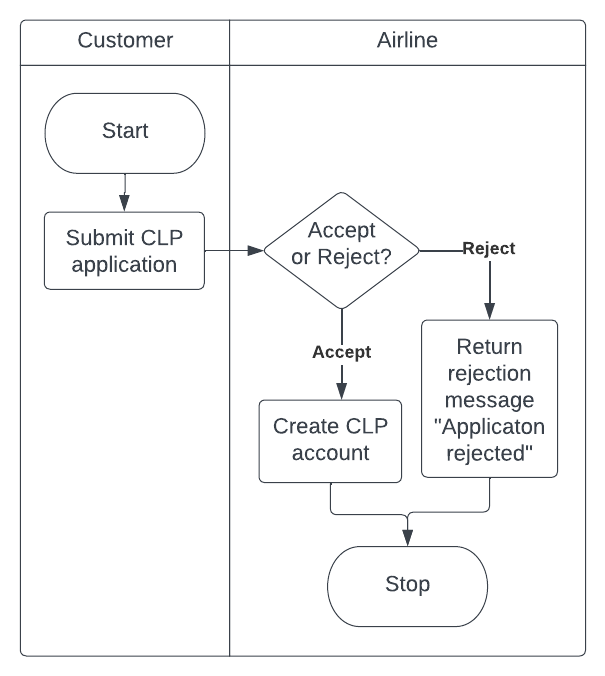
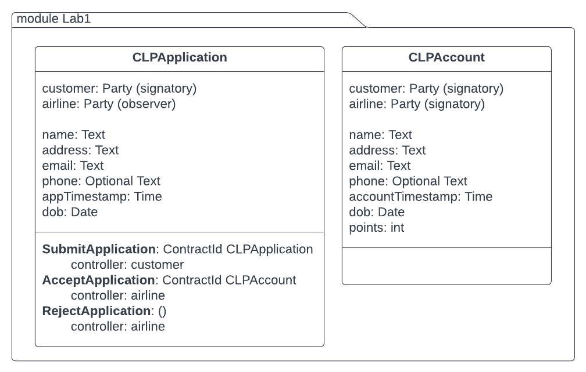
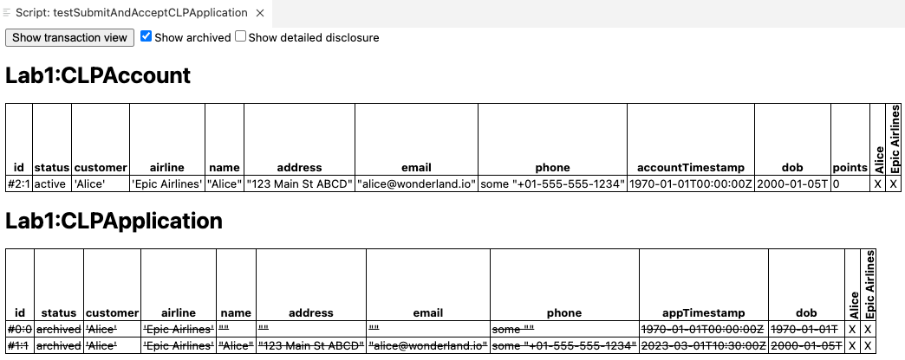

# Lab1 

**Learning objective**: To write and test Daml templates

**Prerequisite**
1. Daml SDK installed and setup
2. Daml Fundamentals Training: Canton Ledger Programming in Daml - Lessons 1 to 4 completed.

## Scenario: 

The **Epic Airlines (EA)** needs to implement its **Customer Loyalty Program (CLP)** using Daml. 
Customers can register for CLP anytime. When they register, they get a CLP-account to store their loyalty points. 

A workflow diagram is shown below:



Customer submits CLP application with the following data:
- Customer name
- Customer Address
- Customer Email
- Customer Phone (optional)
- Customer date of birth
- Application submission date and time

The Airline has a choice to either accept or reject the application. If the application is accepted, then a new CLP account is created for the customer with all their data taken from the application. If it is rejected then no account is created and a text message "Application rejected" is returned. 

## Problem statement 1

Create two templates and their choices as shown in the diagram below. 




The following test scripts test out the scenarios. 

### Test Scenario1: 

Alice submits a CLP application and the Airline accepts the application and creates a CLP account for her. 

```
module TestLab1 where 

import Daml.Script
import Lab1
import DA.Date (toDateUTC, date, Month(Jan), Month(Mar))
import DA.Time (time)

testSubmitAndAcceptCLPApplication: Script () 
testSubmitAndAcceptCLPApplication = script do 
    alice <- allocateParty "Alice"
    airline <- allocateParty "Epic Airlines"
    now <- getTime 

    -- Alice creates a blank CLPApplication
    aliceCLPAppId <- submit alice do         
        createCmd CLPApplication with  
            customer = alice 
            airline = airline 
            name = ""
            address = ""
            email = ""
            phone = Some ""
            appTimestamp = now 
            dob = toDateUTC now

    -- Alice submits the application with details filled in
    aliceCLPAppId <- submit alice do 
        exerciseCmd aliceCLPAppId SubmitApplication 
            with
                appCustomer = alice 
                appAirline = airline
                customerName = "Alice"
                customerAddress = "123 Main St ABCD"
                customerEmail = "alice@wonderland.io"
                customerPhone = "+01-555-555-1234"
                now = time (date 2023 Mar 01) 10 30 0
                customerDob = date 2000 Jan 05                

    -- Airline accepts the application and creates a CLP account with Alice's data
    aliceCLPAccount <- submit airline do 
        exerciseCmd aliceCLPAppId AcceptApplication 
            with 
                points = 0
                accountTimestamp = now

    return ()
```

When this script is executed, it should produce the output as shown below:



*Notice that there are two archived CLPapplications. The first one has empty fields and the second has all the field values filled in with Alice's data. This data is then used to create CLPAccount contract.*  


### Test Scenario2: 

Bob submits a CLP application and the Airline rejects the application and returns a message "Application rejected". 

```
testSubmitAndRejectApplication: Script ()
testSubmitAndRejectApplication = script do 
    bob <- allocateParty "Bob"
    airline <- allocateParty "Epic Airlines"
    now <- getTime 

    -- Bob creates a blank CLPApplication
    bobCLPAppId <- submit bob do         
        createCmd CLPApplication with  
            customer = bob 
            airline = airline 
            name = ""
            address = ""
            email = ""
            phone = Some ""
            appTimestamp = now 
            dob = toDateUTC now

    -- Bob submits the application with details filled in
    bobCLPAppId <- submit bob do 
        exerciseCmd bobCLPAppId SubmitApplication 
            with
                appCustomer = bob 
                appAirline = airline
                customerName = "Bob"
                customerAddress = "123 Spring St EFGH"
                customerEmail = "bob@nomansland.io"
                customerPhone = "+01-555-555-5678"
                now = time (date 2023 Mar 01) 10 30 0
                customerDob = date 2010 Jan 05   


    -- airline rejects the application and returns a message
    applicationResult <- submit airline do 
        exerciseCmd bobCLPAppId RejectApplication 
    
    debug applicationResult

    return ()
```
When this script is executed, it should produce the output as shown below:


The **Transaction View** should show the text message returned by Reject choice at the bottom.

```
Trace: 
  "Application rejected"
```
