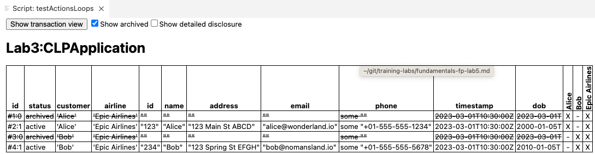
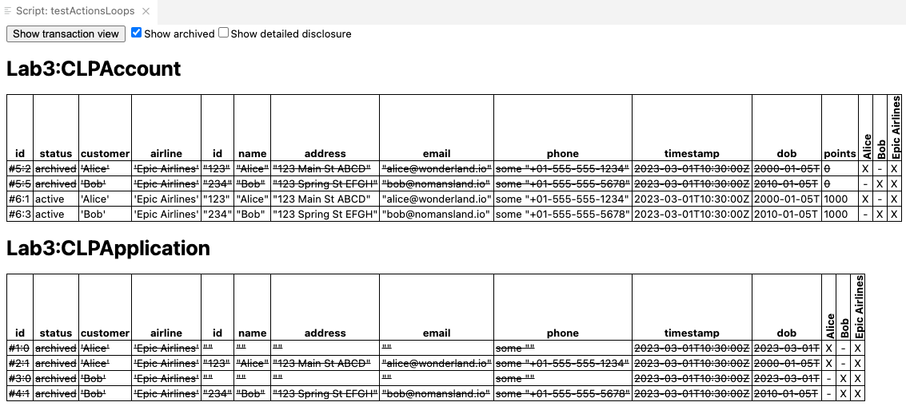

**Lab3**

**Learning objective**: To perform actions in an iterative fashion on a list of contracts

**Prerequisite**
1. Daml SDK installed and setup
2. Daml Fundamentals Training: Canton Ledger Programming in Daml - Lessons 1 to 9 completed.

## Scenario: 

The **Epic Airlines (EA)** needs to implement its **Customer Loyalty Program (CLP)** using Daml. 
Customers can register for CLP anytime. When they register, they get a CLP-account to store their loyalty points.

Continuing from the previous Lab, there are two templates - CLPAApplication and CLPAccount. There is no change required in the code written for these two templates. 


## Problem statement 1

*This problem has two parts*

1. Here is a script that creates CLPApplications for Alice and Bob. 

    ```
    testActionsLoops: Script () 
    testActionsLoops = script do 
        alice <- allocateParty "Alice"
        bob <- allocateParty "Bob"
        airline <- allocateParty "Epic Airlines"
        
        setTime (time (date 2023 Mar 01) 10 30 0)
        now <- getTime 

        -- Alice creates a blank CLPApplication
        aliceCLPAppId <- submit alice do         
            createCmd CLPApplication with  
                customer = alice 
                airline = airline 
                id = ""
                name = ""
                address = ""
                email = ""
                phone = Some ""
                timestamp = now 
                dob = toDateUTC now

        -- Alice submits the application with details filled in
        aliceCLPAppId <- submit alice do 
            exerciseCmd aliceCLPAppId SubmitApplication 
                with
                    appCustomer = alice 
                    appAirline = airline
                    customerId = "123"
                    customerName = "Alice"
                    customerAddress = "123 Main St ABCD"
                    customerEmail = "alice@wonderland.io"
                    customerPhone = "+01-555-555-1234"
                    appTimeStamp = now
                    customerDob = date 2000 Jan 05    

        -- Bob creates a blank application
        bobCLPAppId <- submit bob do         
            createCmd CLPApplication with  
                customer = bob 
                airline = airline 
                id = ""
                name = ""
                address = ""
                email = ""
                phone = Some ""
                timestamp = now 
                dob = toDateUTC now

    -- Bob submits application with details filled in
        bobCLPAppId <- submit bob do 
            exerciseCmd bobCLPAppId SubmitApplication 
                with
                    appCustomer = bob 
                    appAirline = airline
                    customerId = "234"
                    customerName = "Bob"
                    customerAddress = "123 Spring St EFGH"
                    customerEmail = "bob@nomansland.io"
                    customerPhone = "+01-555-555-5678"
                    appTimeStamp = now
                    customerDob = date 2010 Jan 05    
    ```

    Once the above script is run, it should show the following output:

    

    Extend this script to perform the following actions:

    1. The airline queries for all the applications and stores them in **allApplications** which will be a list of tuples (ContractId, Contract payload)
    2. Extract all contract-ids from allApplications and store them in **allApplicationCids**
    3. Extract all customer-ids from contract payloads in allApplications and store them in **allCustomerIds**
    4. Create a new list **allCidsAndIds** of tuples (ContractId, Text) by pairing elements from allApplicationCids and allCustomerIds 

    The following debug statements 
    ```
        debug allApplications
        debug allApplicationCids 
        debug allCidsAndIds
    ```

    should print the output as shown below

    ```
    Trace: 
    [(00aedaddf8684f16bc52e14bf9dac7aeca0c4d7f1d823a7d5420694c8fa7ead7f9,CLPApplication {customer = 'Alice', airline = 'Epic Airlines', id = "123", name = "Alice", address = "123 Main St ABCD", email = "alice@wonderland.io", phone = Some "+01-555-555-1234", timestamp = 2023-03-01T10:30:00Z, dob = 2000-01-05}),(00bdc5727349c856efda728e229f546272586478b258bf83eb724fe3c216c83b65,CLPApplication {customer = 'Bob', airline = 'Epic Airlines', id = "234", name = "Bob", address = "123 Spring St EFGH", email = "bob@nomansland.io", phone = Some "+01-555-555-5678", timestamp = 2023-03-01T10:30:00Z, dob = 2010-01-05})]
    [00aedaddf8684f16bc52e14bf9dac7aeca0c4d7f1d823a7d5420694c8fa7ead7f9,00bdc5727349c856efda728e229f546272586478b258bf83eb724fe3c216c83b65]
    [(00aedaddf8684f16bc52e14bf9dac7aeca0c4d7f1d823a7d5420694c8fa7ead7f9,"123"),(00bdc5727349c856efda728e229f546272586478b258bf83eb724fe3c216c83b65,"234")]
    ```


    ### Hints:
    Here are some of the functions that you may find useful:
    - [query](https://docs.daml.com/daml-script/api/Daml-Script.html#function-daml-script-query-70370) 
    - [map](https://docs.daml.com/daml/stdlib/DA-NonEmpty.html#function-da-nonempty-map-69362) 
    - [zip](https://docs.daml.com/daml/stdlib/Prelude.html#function-da-internal-prelude-zip-87479) 


2. In this part, continue to extend the previous script that performs the following
- The airline submits a transaction that exercises ReviewApplication choices on all the applications and returns a list of CLPAccounts created. This list is stored in **allAccountCids**.
- With the accounts created in the previous step, the airline now exercises the AddPoints choice and adds 1000 points to each account. 

Once the above script is completed, it should have two accounts as shown below:




Add the following statements at the end of your script:

```
   allAccountTuples <- query @CLPAccount airline

    debug allAccountCids 
    debug allAccountTuples 
```

The Transaction Tree view of the script output should show the following output: 

```
[Some 0050eb35ab8c025a0c59a15d5684355cc2d0a2cd4cad8004435a6818ef12192731,Some 005f605dc5ed79d9a98489ce31421d64d365ca550827954cb160c94154d2ef09c1]
  [(00691fb3d8526dc650dee23e15351e16272d18f59e3958a25a3629a784a85b85fc,CLPAccount {customer = 'Alice', airline = 'Epic Airlines', id = "123", name = "Alice", address = "123 Main St ABCD", email = "alice@wonderland.io", phone = Some "+01-555-555-1234", timestamp = 2023-03-01T10:30:00Z, dob = 2000-01-05, points = 1000}),(00b325433392e50fe1f60b06b90671e067df8f08f1332cb0b0c82d950b9ef80d19,CLPAccount {customer = 'Bob', airline = 'Epic Airlines', id = "234", name = "Bob", address = "123 Spring St EFGH", email = "bob@nomansland.io", phone = Some "+01-555-555-5678", timestamp = 2023-03-01T10:30:00Z, dob = 2010-01-05, points = 1000})]
  
```

