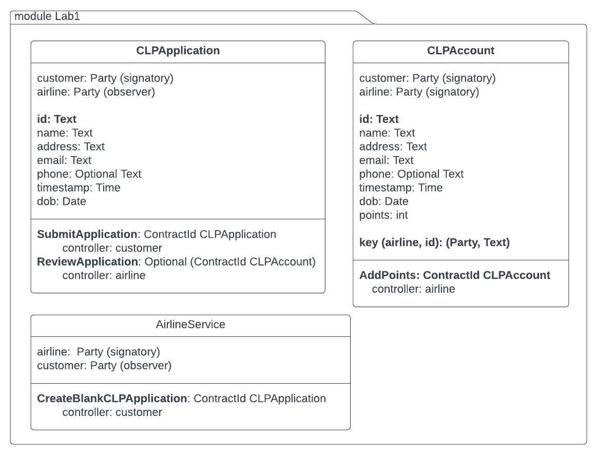

**Lab1**

**Learning objective**: To test and explore Daml templates using Navigator

**Prerequisite**
1. Daml SDK installed and setup
2. Daml Fundamentals Training: Testing in Daml - Lessons 1 to 2 completed.

## Problem statement 1

We will continue with the use-case of **Customer Loyalty Application** for **Epic Airlines** that was introduced in the Course **Canton Ledger Programming with Daml**.

The scenario for this problem is that Alice creates a blank CLPApplication, fills in her details, and submits it to the airline. The airline reviews her application and then creates a CLPAccount for her. 

Notice that the starting point is when Alice creates a blank application. Our templates currently do not have that choice which can be exercised through Navigator. So we need to first create a new template, say **AirlineService**. Make airline as its signatory and customer as its observer. Finally create a choice called **CreateBlankCLPApplication** with customer as its controller. This choice returns a CLPApplication with all fields as blanks or some default values. Note that this choice should be **nonconsuming** so that the AirlineService contract continues after a customer exercises the CreateBlankCLPApplication choice. 

The template diagram will look like as shown below:



Once you have the above templates ready, follow the steps to guide you through the scenario:

1. Write a **setup** function Main.daml that does the following:

- Create two parties named **airline** and **customer**
- Create two user-ids with display-names as "Epic" and "Alice"
- Create two users using the two user-ids created above. Map Epic and Alice to 'airline' and 'customer' respectively with role CanActAs. 
- Write a submit statement to submit a transaction as **airline** to create AirlineService contract. 

Make sure that the setup function is mapped correctly in daml.yaml for init_script as:

```
init-script: Main:setup
```

2. Start navigator by entering the following at the terminal in your project folder.

```
daml start
```

3. Once you have the Navigator web-page up, choose 'Alice' as the user to login. 
4. View the Contracts list, which should show one contract which is the **AirlineService** created through the init-script. 
5. Choose **'CreateBlanCLPApplication'** choice to exercise. This should show an option to Submit. Submit.
6. Go to Contracts and you will see a new contract for CLPApplication. Open that contract, and now choose **SubmitApplication** choice.
5. This should open up a CLP Application with blank fields. Fill in some sample data, with customerID as '123' (or any other text that you can remember) and Submit.
6. Logout and now log in as Epic. 
7. Go to list of Contracts. You should see the CLPApplication with Alice's data filled in. 
8. Choose ReviewApplication choice to exercise. Enter '123' in customerId (or the string that you entered in CLPApplication as customerId). Submit.
9. Go to list of contracts. You should now see a CLPAccount with all the data from CLPApplication and points field having 0.
10. Finally, exercise the choice 'AddPoints' and add some points to the account. Submit.
11. Go back to Contracts list and open the account again. It should reflect the new points added in the previous step. 
12. Once you have explore the outcomes of the steps above, go back to VSCode terminal and terminate the session by Ctrl-C.   

## Problem statement 2

The next step would be to simulate the scenario where Alice tries to submit another application using the same customerId as before. In this case, when the airline exercises ReviewApplication choice, then it should not create another account for her. 

From here, you should be able to explore the steps - 
1. to have Alice create a blank CLPApplication, 
2. submit it with some details filled in, 
3. and have the airline review the application. 
4. If the application has a customerId that exists in any of the CLPAccounts, then a new account should not be created and the CLPApplication should be archived. 


