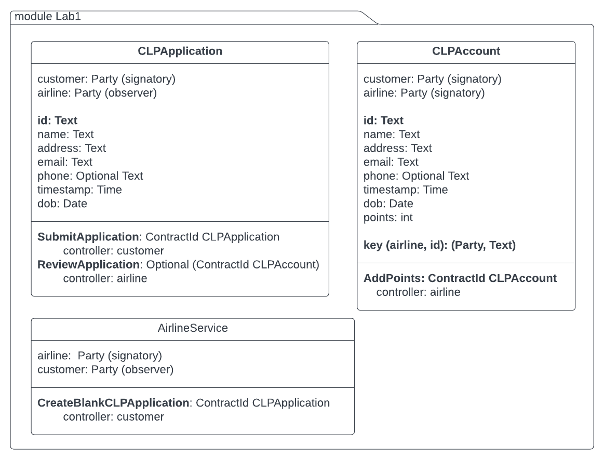

**Lab2**

**Learning objective**: To write modular test cases covering happy and unhappy paths

**Prerequisite**
1. Daml SDK installed and setup
2. Daml Fundamentals Training: Testing in Daml - Lessons 1 to 3 completed.

## Problem statement 1

In this lab, we will continue to use the templates for building a Customer Loyalty Program for Epic Airlines using Daml. With the templates shown in the diagram below, write the script to perform the following steps.



1. Create a data record structure **CLPData** with four fields:
    - customer1: Party
    - customer2: Party
    - customer3: Party 
    - airlineServiceCid: ContractCid AirlineService

2. Create a script **setupCLPData** that takes three Text strings for the names of the three parties and returns a script that creates CLPData with
    - three parties allocated in CLPData using the three Text strings 
    - airlineServiceCid created by the airline party with customer as customer1 and airline as airline. 

    ```
    setupCLPData: Text -> Text -> Text -> Script CLPData
    ```

    To test if you got the above written as needed to proceed, here is a script

    ```
    -- test script to print the test-data
    testScript1: Script () 
    testScript1 = do 
        clpData <- setupCLPData "Alice" "Bob" "Epic"
        debug clpData.customer1
        debug clpData.customer2
        debug clpData.airline
        debug clpData.airlineServiceCid
        return ()
    ```

    The above test script should produce the following output in the Transaction view:
    ```
    Transactions: 
    TX 0 1970-01-01T00:00:00Z (TestLab2:22:26)
    #0:0
    │   disclosed to (since): 'Alice' (0), 'Epic' (0)
    └─> create Lab2:AirlineService
        with
            customer = 'Alice'; airline = 'Epic'

    Active contracts:  #0:0

    Return value: {}

    Trace: 
    'Alice'
    'Bob'
    'Epic'
    008a4482d8cfcc5711535678191caef59378692530a8cee598da9503d2119adc4f

    ```
3. Write a test-script to test the **'unhappy path'** scenario in which 
    - clpData.customer1 (i.e. Alice) submits a transaction to create a blank application using clpData.airlineServiceCid
    - and then clpData.customer2 (i.e. Bob) submits a transaction using  application Cid from the previous step to submit an application. Use **submitMustFail** to ensure that the script goes through to the next step but this transaction fails. 

    The expected output from this script is as shown below:

    ```
    Transactions: 
    TX 0 1970-01-01T00:00:00Z (TestLab2:22:26)
    #0:0
    │   referenced by #1:0
    │   disclosed to (since): 'Alice' (0), 'Epic' (0)
    └─> create Lab2:AirlineService
        with
            customer = 'Alice'; airline = 'Epic'
    
    TX 1 1970-01-01T00:00:00Z (TestLab2:47:43)
    #1:0
    │   disclosed to (since): 'Alice' (1), 'Epic' (1)
    └─> 'Alice' exercises CreateBlankApplication on #0:0 (Lab2:AirlineService)
        children:
        #1:1
        │   disclosed to (since): 'Alice' (1), 'Epic' (1)
        └─> create Lab2:CLPApplication
            with
                customer = 'Alice';
                airline = 'Epic';
                id = "";
                name = "";
                address = "";
                email = "";
                phone = some "";
                timestamp = 1970-01-01T00:00:00Z;
                dob = 1970-01-01T
    
    TX 2 1970-01-01T00:00:00Z
        mustFailAt actAs: {'Bob'} readAs: {} (TestLab2:50:28)

    Active contracts:  #0:0, #1:1

    Return value: {}
    ```

4. Extend the previous script to test the **happy path** scenario where 
    - Alice exercises SubmitApplication choice on the blank application created in the previous step
    - Airline reviews Alice's application which results in Alice's account being created.
    - Airline exercises AddPoints to add 100 points to her account

    The final output should look as shown below. Notice that TX2 fails but the script continues to execute the rest of the transactions.

    ```
    Transactions: 
    TX 0 1970-01-01T00:00:00Z (TestLab2:22:26)
    #0:0
    │   referenced by #1:0
    │   disclosed to (since): 'Alice' (0), 'Epic' (0)
    └─> create Lab2:AirlineService
        with
            customer = 'Alice'; airline = 'Epic'
    
    TX 1 1970-01-01T00:00:00Z (TestLab2:47:43)
    #1:0
    │   disclosed to (since): 'Alice' (1), 'Epic' (1)
    └─> 'Alice' exercises CreateBlankApplication on #0:0 (Lab2:AirlineService)
        children:
        #1:1
        │   consumed by: #3:0
        │   referenced by #3:0
        │   disclosed to (since): 'Alice' (1), 'Epic' (1)
        └─> create Lab2:CLPApplication
            with
                customer = 'Alice';
                airline = 'Epic';
                id = "";
                name = "";
                address = "";
                email = "";
                phone = some "";
                timestamp = 1970-01-01T00:00:00Z;
                dob = 1970-01-01T
    
    TX 2 1970-01-01T00:00:00Z
        mustFailAt actAs: {'Bob'} readAs: {} (TestLab2:50:28)
    
    TX 3 1970-01-01T00:00:00Z (TestLab2:74:43)
    #3:0
    │   disclosed to (since): 'Alice' (3), 'Epic' (3)
    └─> 'Alice' exercises SubmitApplication on #1:1 (Lab2:CLPApplication)
                with
                    appCustomer = 'Alice';
                    appAirline = 'Epic';
                    customerId = "123";
                    customerName = "Alice";
                    customerAddress = "ABC Main Street, NY";
                    customerEmail = "alice@wonderland.io";
                    customerPhone = "123-555-1234";
                    appTimeStamp = 1970-01-01T00:00:00Z;
                    customerDob = 2000-01-10T
        children:
        #3:1
        │   consumed by: #4:0
        │   referenced by #4:0
        │   disclosed to (since): 'Alice' (3), 'Epic' (3)
        └─> create Lab2:CLPApplication
            with
                customer = 'Alice';
                airline = 'Epic';
                id = "123";
                name = "Alice";
                address = "ABC Main Street, NY";
                email = "alice@wonderland.io";
                phone = some "123-555-1234";
                timestamp = 1970-01-01T00:00:00Z;
                dob = 2000-01-10T
    
    TX 4 1970-01-01T00:00:00Z (TestLab2:87:39)
    #4:0
    │   disclosed to (since): 'Alice' (4), 'Epic' (4)
    └─> 'Epic' exercises ReviewApplication on #3:1 (Lab2:CLPApplication)
                with
                customerId = "123"
        children:
        #4:1
        │   disclosed to (since): 'Alice' (4), 'Epic' (4)
        └─> lookupByKey Lab2:CLPAccount
            with key
                _1 = 'Epic'; _2 = "123"
            not found
        
        #4:2
        │   consumed by: #5:0
        │   referenced by #5:0
        │   disclosed to (since): 'Alice' (4), 'Epic' (4)
        └─> create Lab2:CLPAccount
            with
                customer = 'Alice';
                airline = 'Epic';
                id = "123";
                name = "Alice";
                address = "ABC Main Street, NY";
                email = "alice@wonderland.io";
                phone = some "123-555-1234";
                timestamp = 1970-01-01T00:00:00Z;
                dob = 2000-01-10T;
                points = 0
    
    TX 5 1970-01-01T00:00:00Z (TestLab2:93:39)
    #5:0
    │   disclosed to (since): 'Alice' (5), 'Epic' (5)
    └─> 'Epic' exercises AddPoints on #4:2 (Lab2:CLPAccount)
                with
                newPoints = 100
        children:
        #5:1
        │   disclosed to (since): 'Alice' (5), 'Epic' (5)
        └─> create Lab2:CLPAccount
            with
                customer = 'Alice';
                airline = 'Epic';
                id = "123";
                name = "Alice";
                address = "ABC Main Street, NY";
                email = "alice@wonderland.io";
                phone = some "123-555-1234";
                timestamp = 1970-01-01T00:00:00Z;
                dob = 2000-01-10T;
                points = 100

    Active contracts:  #0:0, #5:1

    Return value: {}


    ```